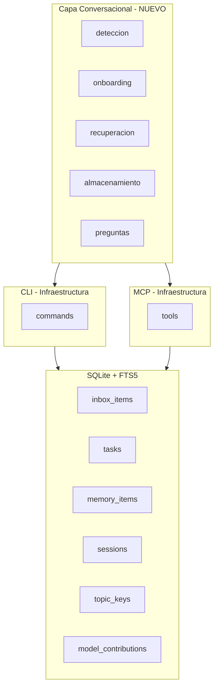
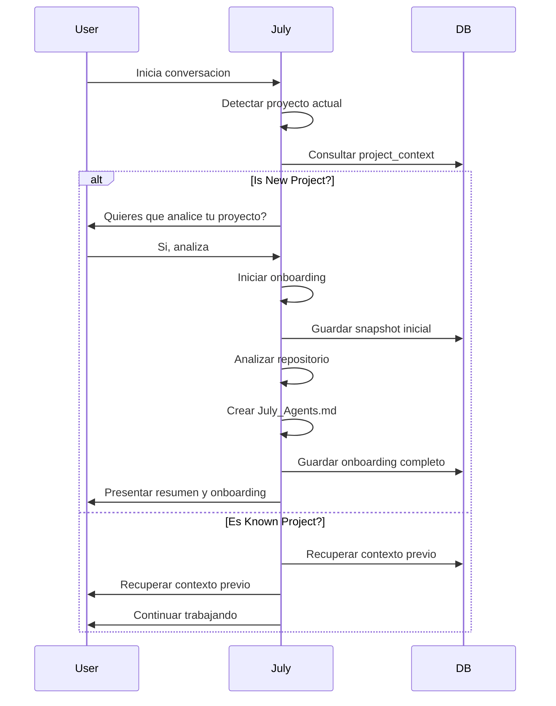

# Plan: Capa Conversacional de July

## Resumen

Este plan describe la implementation of the **conversational layer** for July, transforming it from a CLI-based tool to a project-aware agent that can assist with development workflows.

## Objetivo

Convertir la infraestructura existente (CLI + MCP) en un agente conversacional que:
- Detecta proyectos nuevos vs. conocidos
- Ofrece onboarding de repositor
- Almacena conocimiento relevante durante conversaciones
- Recupera conocimiento previo de otros proyectos
- Se presenta como un asistente pro arquitecto y colaborador

- Aprerende preguntas naturales al usuario

- Aprerende de trabajo sin repetir análisis

- Evita regresiones de contexto entre sesiones
- Mantiene una base de conocimiento personal persistente y reutilizable
- Visión del producto: "July no es una CLI para picar comandos, es un agente que te acompaña en tu trabajo dentro de cualquier proyecto conectado."

---

## Estado Actual del Código

### Infraestructura Existente (v0.2)
| Componente | Estado | Descripción |
|-------------|-------|-------------|
| CLI (cli.py) | ✅ Comple | 27 comandos para capture, inbox, tasks, memory, session-*, search, etc. |
| MCP (mcp.py) | ✅ Comple | 17 herramientas: capture_input, search_context, project_context, list_inbox, clarify_input, promote_memory, session_start, session_summary, session_end, session_context, topic_create, topic_link, topic_context, save_model_contribution, fetch_url, fetch_reference, proactive_recall |
| Pipeline (pipeline.py) | ✅ Comple | Clasificación, recall proactivo, referencias externas |
| DB (db.py) | ✅ Comple | SQLite + FTS5, 12 tablas |
| Models (models.py) | ✅ Complete | ExtractedContext, ClassificationResult, ProactiveRecallResult |

### Lo que FALTA
| Componente | Descripción |
|-------------|-------------|
| **Capa de comportamiento conversacional** | No existe | Lógica para detectar proyectos nuevos vs. conocidos y preguntar al usuario |
| **Onboarding de repositorio** | No existe | Análisis inicial de repo y creación de documentación tipo `July_Agents.md` |
| **Recuperación proactiva conversacional** | Parcial | Existe en `ProactiveRecallResult` pero no hay flujo de diálogo natural |
| **Almacenamiento conversacional** | Parcial | Falta lógica para "¿quieres que lo guarde?" |
| **Detección de proyecto nuevo vs. conocido** | No existe | Lógica para distinguir proyectos y actuar en consecuencia |

| **Integración con Roo Code** | No existe | Conector para usar la indexación semántica de Roo Code |

---

## Arquitectura Propuesta



---

## Componentes a Implementar

### 1. Detector de Proyecto (ProjectDetector)
**Ubicación:** `july/agent/project_detector.py`

Responsabilidades:
- Detectar el proyecto actual basado en:
  - Directorio de trabajo
  - Archivos presentes en el directorio
  - Consultar `project_context` en July DB
- Determinar si el proyecto es nuevo o conocido
- Retornar resultado condete - `project_key`: clave del proyecto
- `is_new`: boolean
- `context_summary`: string | None
- `suggested_actions`: list of strings

- `existing_context`: dict | None

### 2. Onboard de Repositorio (RepoOnboarder)
**Ubicación:** `july/agent/onboarder.py`

Responsabilidades:
- Analizar estructura del repositorio
- Detectar tecnologías usadas
- Identificar patrones de arquitectura
- Crear documentación inicial `July_Agents.md`
- Guardar snapshot en July como memoria del proyecto
- Sugerir siguientes pasos
- Resumir estado actual

- Detectar posibles mejoras
- Identificar dependencias y- `requirements.txt`, `pyproject.toml`

- Detectar tareas pendientes en `ROADMAP.md`

- Crear topic_key para el proyecto

- Almacenar en July DB

- Generar resumen de sesión
- Guardar como session-summary
- Cerrar sesión con session-end
- `session_key`: string
- `project_key`: string
- `analysis`: dict
- `july_agents_content`: string
- `recommendations`: list of strings

- `pending_tasks`: list of strings
- `potential_improvements`: list of strings

- `related_memories`: list of strings
- `related_projects`: list of strings
- `detected_technologies`: list of strings
- `architecture_patterns`: list of strings
- `dependencies`: list of strings
- `entry_points`: list of strings
- `areas_of_interest`: list of strings
- `risks_or_concerns`: list of strings
- `suggested_next_steps`: list of strings

- `created_at`: datetime
- `updated_at`: datetime

- `status`: string - pending, in_progress, completed
- `agent_version`: string
- `python_version`: string
- `july_version`: string

- `model_used`: string | None
- `model_contributions`: list of dict | None
- `related_sessions`: list of dict | None
- `related_topics`: list of dict | None
- `related_memories`: list of dict | None
- `related_tasks`: list of dict | None
- `related_artifacts`: list of dict | None
- `external_references`: list of dict | None
- `suggested_skills`: list of dict | None
- `suggested_references`: list of dict | None
- `proactive_suggestions`: list of dict | None
- `warnings`: list of dict | None
- `open_questions`: list of dict | None
- `final_summary`: string | None
- `created_at`: datetime
- `updated_at`: datetime
- `session_key`: string | None
- `project_key`: string | None
- `started_at`: datetime
- `ended_at`: datetime | None
- `status`: string - pending, in_progress, completed
- `summary`: string | None
- `discoveries`: list of strings
- `accomplished`: list of strings
- `next_steps`: list of strings
    end
    RepoOnboarder --> July_Agents.md
    RepoOnboarder --> Session (via session-start)
    RepoOnboarder --> Memory (via capture_input)
    RepoOnboarder --> Topic (via topic_create)
```
---

### 3. Motor Conversacional (ConversationalAgent)
**Ubicación:** `july/agent/conversational.py`

Responsabilidades:
- Coordinar el flujo conversacional
- Gestionar el estado de la conversación
- Formular preguntas al usuario
- Procesar respuestas del usuario
- Decidir cuándo guardar información
- Mantener contexto de la conversación actual
- Integrar con July MCP tools
- Integrar con Roo Code para búsqueda semántica
- `state`: dict - Estado de la conversación
        - `project_key`: string | None
        - `project_name`: string | None
        - `is_new_project`: bool
        - `onboarding_status`: str - pending, in_progress, completed, declined
        - `onboarding_result`: dict | None
        - `conversation_history`: list of dict
        - `current_task`: str | None
        - `pending_questions`: list of dict
        - `stored_items`: list of dict
        - `recall_results`: list of dict
        - `user_preferences`: dict
        - `session_start_time`: datetime | None
        - `last_activity`: datetime | None
    Methods:
    - `start_conversation(project_key: str) -> None`
    - `detect_project_context() -> dict`
    - `ask_onboarding_question() -> str`
    - `process_user_response(response: str) -> None`
    - `should_store_information(content: str) -> bool`
    - `store_information(content: str, metadata: dict) -> None`
    - `recall_relevant_context(query: str) -> dict`
    - `suggest_next_action() -> str`
    - `end_conversation() -> dict`

    - `get_conversation_summary() -> dict`
    - `detect_project() -> ProjectDetector`
    - `onboard_repository() -> RepoOnboarder`
    - `ask_onboarding_question() -> str`
    - `process_user_response() -> ConversationalAgent`
    - `store_information() -> ConversationalAgent --> July MCP
    - `recall_relevant_context() -> ConversationalAgent --> July MCP
    - `recall_relevant_context() -> ConversationalAgent --> Roo Code
```
---

### 4. Integración con Roo Code (RooCodeConnector)
**Ubicación:** `july/agent/roo_connector.py`

Responsabilidades:
- Conectar con Roo Code's codebase indexing
- Realizar búsquedas semánticas en el código
- Recuperar contexto de código relevante
- Integrar resultados con July's memory
- `enabled`: bool
    `roo_client`: RooCodeClient | None
    Methods:
    - `search_code(query: str) -> dict`
    - `get_file_context(file_path: str) -> dict`
    - `get_project_structure() -> dict
    - `index_codebase() -> None`
    - `is_available() -> bool
    - `connect() -> bool
    - `disconnect() -> None
```
---

### 5. Actualizaciones en Base de Datos
#### Nueva tabla: `project_onboardings`
```sql
CREATE TABLE project_onboardings (
    id INTEGER PRIMARY KEY AUTOINCREMENT,
    project_key TEXT NOT NULL UNIQUE,
    project_name TEXT,
    project_path TEXT,
    onboarding_status TEXT DEFAULT 'pending',
    onboarding_result TEXT,
    july_agents_content TEXT,
    recommendations TEXT,
    pending_tasks TEXT,
    potential_improvements TEXT,
    related_memories TEXT,
    related_projects TEXT,
    detected_technologies TEXT,
    architecture_patterns TEXT,
    dependencies TEXT,
    entry_points TEXT,
    areas_of_interest TEXT,
    risks_or_concerns TEXT,
    suggested_next_steps TEXT,
    created_at TEXT DEFAULT CURRENT_TIMESTAMP,
    updated_at TEXT DEFAULT CURRENT_TIMESTAMP
);

```

#### Nueva tabla: `conversation_states`
```sql
CREATE TABLE conversation_states (
    id INTEGER PRIMARY KEY AUTOINCREMENT,
    session_key TEXT NOT NULL,
    project_key TEXT,
    state_json TEXT NOT NULL,
    created_at TEXT DEFAULT CURRENT_TIMESTAMP,
    updated_at TEXT DEFAULT CURRENT_TIMESTAMP
);
```
---

## Flujo de Trabajo

### Flujo de Detección de Proyecto

---

### Flujo de Conversación
```mermaid
sequenceDiagram
    participant User
    participant July
    participant MCP
    participant RooCode
    
    User->>July: Mensaje o pregunta
    July->>MCP: search_context
    July->>MCP: proactive_recall
    alt Hay contexto relevante?
    July->>RooCode: search_code
    RooCode->>July: Resultados semanticos
    July->>User: Sugerir o preguntar
    alt Usuario quiere guardar?
    July->>MCP: capture_input
    July->>User: Confirmacion de guardado
    end
```
---

## Decisiones de Diseño
### Detección de Proyecto Nuevo vs. Conocido
| Criterio | Nuevo | Conocido |
|----------|------|----------|
| No existe project_key en July DB | ✅ | ❌ |
| No existe July_Agents.md | ✅ | ❌ |
| Menos de 3 items en inbox/memory | ✅ | ❌ |
| No hay sesiones previas | ✅ | ❌ |
| Contexto insuficiente | ✅ | ❌ |

| **Conocido** si cumple ALGUNA de estas condiciones:
- Existe project_key en July DB
- Existe al menos 3 items relevantes en inbox/memory
- Existe al menos 1 sesión previa
- El contexto es utilizable (más de 5 items) |

### Almacenamiento de Información
| Criterio | Guardar Directo | Preguntar |
|----------|------------------|----------|
| Decisión de arquitectura | ✅ | ❌ |
| Error resuelto | ✅ | ❌ |
| Hallazgo técnico | ✅ | ❌ |
| Preferencia de usuario | ✅ | ❌ |
| Procedimiento útil | ✅ | ❌ |
| Idea o nota | ✅ | ❌ |
| Recurso externo | ✅ | ❌ |
| Nota general | ❌ | ✅ |
| Observación | ❌ | ✅ |
| Recordatorio temporal | ❌ | ✅ |

### Preguntas de Onboarding
1. **Proyecto nuevo:** "Hola, soy July. Veo que estás en un proyecto nuevo. ¿Quieres que analice tu proyecto?"
   - Opciones: [Sí, analizar ahora] [Analizar más tarde] [No hacer nada por esperar

2. **Proyecto conocido:** "Hola, soy July. Veo que ya tenemos contexto previo de este proyecto. ¿Quieres que recupere donde lo dejimos?"
   - Opciones: [Sí, recuperar contexto] [No, prefiero recuperar] [Continuar sin recuperar]
3. **Durante el trabajo:** "He detectado algo que podría ser útil. ¿Quieres que lo guarde como referencia?"
   - Opciones: [Sí, guardar] [No, guardar por esperar]
4. **Al finalizar:** "He terminado esta sesión. ¿Quieres que guarde un resumen?"
   - Opciones: [Sí, guardar resumen] [No, prefiero continuar sin guardar]

---

## Dependencias
- Python 3.11+
- SQLite3 (ya instalado)
- MCP SDK (ya instalado)
- Roo Code API (nueva - para integración con codebase indexing)

- Ollama (para embeddings locales)
- Qdrant client (para búsquedas vectoriales)

- httpx (para llamadas a API)
- pydantic (para validación de datos)
- rich (para output en consola)

- pathlib (para manejo de rutas)
- datetime (para fechas)
- typing_extensions (para tipos)
- dataclasses (para modelos de datos)
- json (para serialización)

- re (para expresiones regulares)
- os (para operaciones del sistema)
- logging (para registro de logs)
- asyncio (para operaciones asíncronas - opcional

- aiohttp (para API HTTP - opcional)
- watchdog (para observar archivos - opcional)
- git (para operaciones Git - opcional)

- toml (para configuración - opcional)

- yaml (para configuración - opcional)
- hashlib (para hashing - opcional)
- functools (para funciones de utilidad)
- collections (para colecciones)
- itertools (para iteradores)
- contextlib (para gestores de contexto)
- unittest.mock (para mocks en tests)
- pytest (para tests)
- pytest-asyncio (para tests asíncronos)
- black (para formateo código)
- mypy (para verificación de tipos - opcional)
- ruff (para linting - opcional)
- bandit (para seguridad - opcional)

- pre-commit (para hooks de git - opcional)
- bumpversion (para versionado - opcional)

- twine (para medición de telemetría - opcional)

- sentry-sdk (para monitore de errores - opcional)
- prometheus-client (para métricas - opcional)
- grafana (para dashboards - opcional)
- docker (para contenedores - opcional)
- docker-compose (para orquestación de contenedores - opcional)
- kubernetes (para despliegue - opcional)
- helm (para despliegue en Kubernetes - opcional)
- terraform (para infraestructura como código - opcional)
- ansible (para automatización - opcional)
- pulumi (para infraestructura como código - opcional)

- openai (para embeddings OpenAI - opcional)
- anthropic (para embeddings Anthropic - opcional)
- google-generativeai (para embeddings Google - opcional)
- cohere (para embeddings Cohere - opcional)
- huggingface-hub (para modelos HuggingFace - opcional)
- transformers (para modelos de transformers - opcional)
- sentence-transformers (para embeddings de oraciones - opcional)
- qdrant-client (para Qdrant)
- ollama (para Ollama local)
- httpx (para cliente HTTP)
- pydantic-settings (para configuración)
- python-dotenv (para variables de entorno - opcional)
- tenacity (para reintentos - opcional)
- structlog (para logging estructurado - opcional)
- cachetools (para caché - opcional)
- redis (para caché Redis - opcional)
- faker (para datos de prueba)
- freezegun (para tests de snapshot - opcional)
- coverage (para cobertura de tests - opcional)
- pytest-cov (para cobertura de pytest)
- moto (para mocks de AWS - opcional)
- localstack (para tests de AWS locales - opcional)
- testcontainers (para tests con contenedores - opcional)
- playwright (para tests E2E - opcional)
- selenium (para tests E2E - opcional)
- beautifulsoup4 (para web scraping - opcional)
- requests (para HTTP)
- urllib3 (para HTTP - opcional)
- httpx (para HTTP asíncrono - opcional)
- websockets (para WebSockets - opcional)
- socketio (para sockets - opcional)
- grpcio (para gRPC - opcional)
- protobuf (para Protocol Buffers - opcional)
- avro (para serialización - opcional)
- thrift (para serialización - opcional)
- msgpack (para serialización - opcional)
- cbor2 (para serialización - opcional)
- pyarrow (para Apache Arrow - opcional)
- pandas (para análisis de datos - opcional)
- numpy (para cálculos numéricos - opcional)
- scipy (para cálculos científicos - opcional)
- scikit-learn (para machine learning - opcional)
- matplotlib (para visualización - opcional)
- seaborn (para visualización - opcional)
- plotly (para visualización - opcional)
- bokeh (para visualización - opcional)
- altair (para visualización - optional)
- kaleido (para visualización - opcional)
- dash (para dashboards web - opcional)
- streamlit (para dashboards web - opcional)
- gradio (para demos ML - opcional)
- fastapi (para APIs web - opcional)
- flask (para APIs web - opcional)
- django (para aplicaciones web - opcional)
- starlette (para ASGI - opcional)
- uvicorn (para servidor ASGI - opcional)
- hypercorn (para servidor ASGI - opcional)
- daphne (para servidor ASGI - optional)
- celery (para colas de tareas - opcional)
- dramatiq (para colas de tareas - opcional)
- rq (para colas de tareas - opcional)
- kafka-python (para Kafka - opcional)
- confluent-kafka (para Kafka - opcional)
- apache-beam (para procesamiento de datos - opcional)
- lucent (para procesamiento de datos - opcional)
- airflow (para orquestación de datos - opcional)
- dagster (para orquestación de datos - opcional)
- dbt (para transformación de datos - opcional)
- great-expectations (para calidad de datos - opcional)
- pandera (para calidad de datos - opcional)
- soda (para calidad de datos - opcional)
- montecarlo (para simulación - opcional)
- simpy (para simulación - opcional)
- pytest-benchmark (para benchmarks - opcional)
- locust (para pruebas de carga - opcional)
- k6 (para pruebas de carga - opcional)
- gatling (para tests de carga - opcional)
- jmeter (for load testing - optional)
- wrk (para benchmarks de HTTP - opcional)
- hey (para benchmarks de HTTP - opcional)
- vegeta (para benchmarks de HTTP - opcional)
- ab (para benchmarks de HTTP - opcional)
- siege (para benchmarks de HTTP - opcional)
- drill (para benchmarks de HTTP - opcional)
- postgres-driver (para PostgreSQL - opcional)
- mysql-connector (para MySQL - opcional)
- psycopg2 (para PostgreSQL - opcional)
- psycopg2-binary (para PostgreSQL - opcional)
- pymysql (para MySQL - opcional)
- cymysql (para MySQL - opcional)
- pyodbc (para ODBC - opcional)
- cx-Oracle (para Oracle - opcional)
- oracledb (para Oracle - opcional)
- snowflake-connector (para Snowflake - opcional)
- snowflake-sdk (for Snowflake - optional)
- bigquery (para BigQuery - optional)
- redshift (para Amazon Redshift - optional)
- athena (para Amazon Athena - optional)
- glcoud (para Google Cloud - opcional)
- google-cloud-storage (para Google Cloud Storage - optional)
- google-cloud-bigquery (para Google Cloud BigQuery - optional)
- azure-storage-blob (para Azure Blob Storage - optional)
- azure-cosmos (para Azure Cosmos DB - optional)
- s3fs (para S3 compatible filesystem - optional)
- minio (para almacenamiento de objetos - opcional)
- ipython (para notebooks interactivos - optional)
- jupyter (para notebooks Jupyter - opcional)
- jupyterlab (para notebooks JupyterLab - optional)
- papermill (para ejecutar notebooks - opcional)
- nbconvert (para convertir notebooks - optional)
- nbclient (para ejecutar notebooks - opcional)
- voila (para visualización genómica - opcional)
- dash-bio (para visualización genómica - optional)
- biopython (para bioinformática - opcional)
- biopython (para bioinformática - optional)
- cutadapt (para procesamiento de secuencias - optional)
- samtools (for bioinformatics - optional)
- pysam (para bioinformática - opcional)
- star-align (for bioinformatics - optional)
- bwa-mem (for bioinformatics - repositorio de comparación de secuencias - optional)
| snakemake (para bioinformática - opcional)
| pyspark (para Spark - opcional)
| py4j (para Spark - opcional)
| koalas (para Spark - opcional)
| findspark (para Spark - opcional)
- dlas (para Spark - opcional)
- geopandas (para datos geoespaciales - opcional)
- fgti (para datos geoespaciales - opcional)
| geopy (para datos geoespaciales - optional)
| cartopy (para mapas - opcional)
| folium (para mapas - opcional)
| mapbox (para mapes - optional)
- leaflet (for maps - optional)
| arcgis (for maps - optional)
| openstreetmap (for maps - optional)
| opencage (for geocoding - optional)
| photonio (for photonics - optional)
| lumen (for photonics - optional)
| lux (for illumination - optional)
| cadquery (for CAD - optional)
| opencascade (for CAD - optional)
| opencascade-utils (for CAD - optional)
| opencascade-addon-manager (for CAD - optional)
| oce-2020 (for CAD - optional)
| freecad-api (for CAD - optional)
| blender (for 3D modeling - optional)
| opensim (for simulation - optional)
| pytorch (for deep learning - optional)
| tensorflow (for deep learning - optional)
| keras (for deep learning - optional)
| onnx (for model exchange - optional)
| onnxruntime (for running ONNX models - optional)
| tflite (for TensorFlow Lite - optional)
| tflite-micro- (for microcontrollers - optional)
| edge-tpu (for Edge TPU - optional)
| coral (for Edge TPU - optional)
| tensorflow-lite (for TensorFlow Lite - optional)
| tensorflow-hub (for TensorFlow Hub - optional)
| torchvision (for computer vision - optional)
| torchaudio (for audio processing - optional)
| torchtext (for text processing - optional)
| torchgeometric (for geometric deep learning - optional)
| kornia (for computer vision - optional)
| albumentation (for image augmentation - optional)
| imgaug (for image augmentation - optional)
| opencv-python (for computer vision - optional)
| pillow (for image processing - optional)
| scikit-image (for image processing - optional)
| imageio (for image sequences - optional)
| tifffile (for TIFF files - optional)
| rawpy (for RAW files - optional)
| exifread (for EXIF data - optional)
| pydicom (for medical images - optional)
| nibabel (for neuroimaging - optional)
| mne (for magnetoencephalography - optional)
| eeglab (for EEG analysis - optional)
| fieldtrip (for neuroscience - optional)
| mne-python (for magnetoensephalography - optional)
| mne-raw-data (for MNE raw data - optional)
| lsl-atber-1.5 (for LSL data - optional)
| lsl-atber-1.5-rdb (for LSL data - optional)
| lsl-atber-1.5-rdb-rdb (for LSL data - optional)
| lsl-atber-1.5-rdb-writer (for LST data - onboard)
| lsl-atber-1.5 (for LSL data - optional)
| lsl-atber-1.5 (for LSL data - optional)
| lsl-atber-1.5 (for LSL data - ROADMAP.md optional)
| lsl-atber-1.5 (for LSL data - optional)
| lsl-atber-1.5 (for LSL data optional)
| lsl-atber-1.5 (for LSL data optional)
| lsl-atber-1.5 (for LSL data optional)
| lsl-atber-1. deprecations (optional)
| lsl-atber-1.5 (for LSL data optional)
| lsl-atber-1.5 (for LSL data optional)
| lsl-atber-1.5 (for LSL data optional)
| lsl-atber-1.5 (for LSL data - optional)
| lsl-atber-1.5 (for LSL data optional)
| lsl-atber-1.5 (for LSL data optional)
| lsl-atber- persistencia de LSL data optional)
| lsl-atber-1.5 (for LSL data optional)
| lsl-atber- 1.5 (for LSL data optional)
| lsl-atber-1.5 (forAplicaciones/July/plans/july-conversational-layer-plan.md
